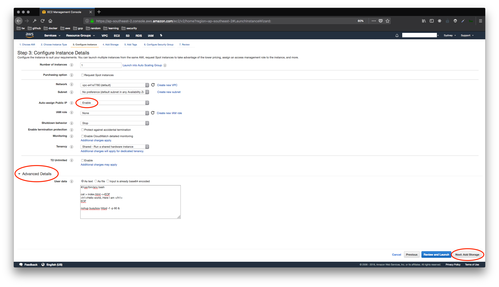
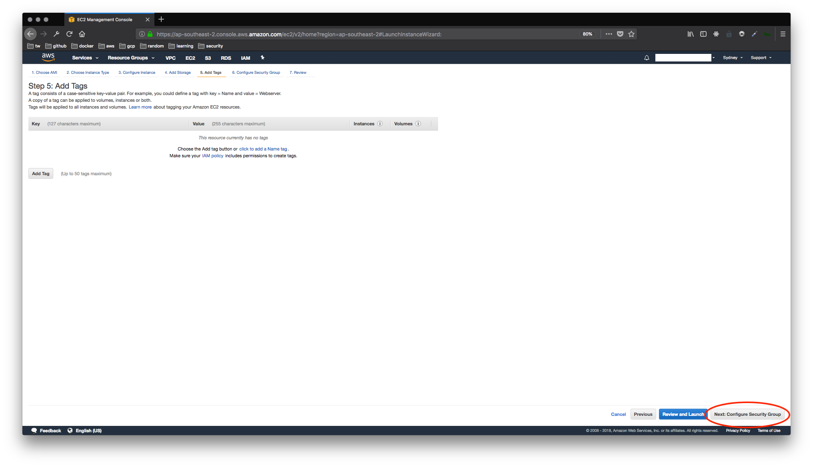

# Getting started with AWS

1. Create an AWS account
2. Go to the EC2 Management console

3. Create a key pair


Save the key file locally.

Go back to the EC2 Management console.


Select the Ubuntu AMI

Select an instance type

Enable public IP address and click add storage


Under Advanced Details > User data, add:

```sh
#!/usr/bin/env bash

cat > index.html <<EOF
<h1>Hello world, Here I am </h1>
EOF

nohup busybox httpd -f -p 80 &
```

Your instance will run this script as soon as it boots up, serving your `index.html` file on port 80.

Click add tags

Click configure security groups

Configure SSH and HTTP

Review your settings and click launch

Add your key to the instance. This is what you will need to connect via SSH

Check that your instance is up and running

Get your public IP address and your DNS hostname

Visit your web page

Log in to your instance via SSH

Change key permissions

```sh
chmod 0600 <private_key_directory>/<your_private_key>.pem
ssh-add <private_key_directory>/<your_private_key>.pem
```

Check your key is added to ssh-agent

```sh
ssh-add -l
```


## Important caveats
Please note that this set up is for demonstration purposes only.

This setup is not secure.

You should be enforcing HTTPS.

It is also not best practice to allow SSH connections directly into your web server, as we do here.

If you want to know more, search google to learn how to set up private and public subnets and learn about bastion hosts.
